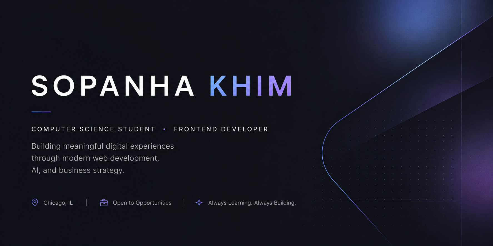

<p align="center">
  
</p>

```ts
const sopanha = {
  name: "Sopanha Khim",
  role: "Computer Science Student",
  location: "Chicago, IL",

  building: [
    "Software Engineering",
    "Web Development",
    "Artificial Intelligence",
    "Digital Products"
  ],

  mission:
    "Building practical digital solutions that connect technology, businesses, and people.",

  currentFocus: [
    "Next.js",
    "React",
    "TypeScript",
    "Tailwind CSS",
    "SQL",
    "Python"
  ],

  currentlyWorkingOn: [
    "Professional Portfolio",
    "Centurion Intelligence",
    "Lucky Alanka"
  ]
};
```

<br/>

## About

I enjoy transforming ideas into practical digital experiences through thoughtful engineering, clean design, and business-driven problem solving. My work combines software engineering, modern web development, artificial intelligence, and product thinking to create technology that is functional, intuitive, and valuable.

As a Computer Science student, I continuously expand my technical skills while applying them to real-world client projects, personal products, and collaborative development.

## Featured Projects

### Personal Portfolio
Professional portfolio built with **Next.js**, **React**, **TypeScript**, and **Tailwind CSS**.

**Website**  
🌐 https://www.sopanhakhim.com

---

### Centurion Intelligence

Leading the redesign and development of a modern corporate website focused on user experience, information architecture, and technical presentation using Webflow.

---

### Lucky Alanka

Building a premium e-commerce jewelry brand by combining web development, branding, SEO, customer experience, and AI-assisted workflows.

---

## Tech Stack

### Languages

`JavaScript` • `TypeScript` • `SQL` • `Python`

### Frontend

`Next.js` • `React` • `Tailwind CSS` • `HTML5` • `CSS3`

### Tools

`Git` • `GitHub` • `Vercel` • `Webflow` • `Shopify` • `WordPress` • `Figma`

---

## Connect

Portfolio  
🌐 https://www.sopanhakhim.com

LinkedIn  
💼 https://www.linkedin.com/in/khim-sopanha-71a41a3a5

GitHub  
💻 https://github.com/Sopanhakhim
